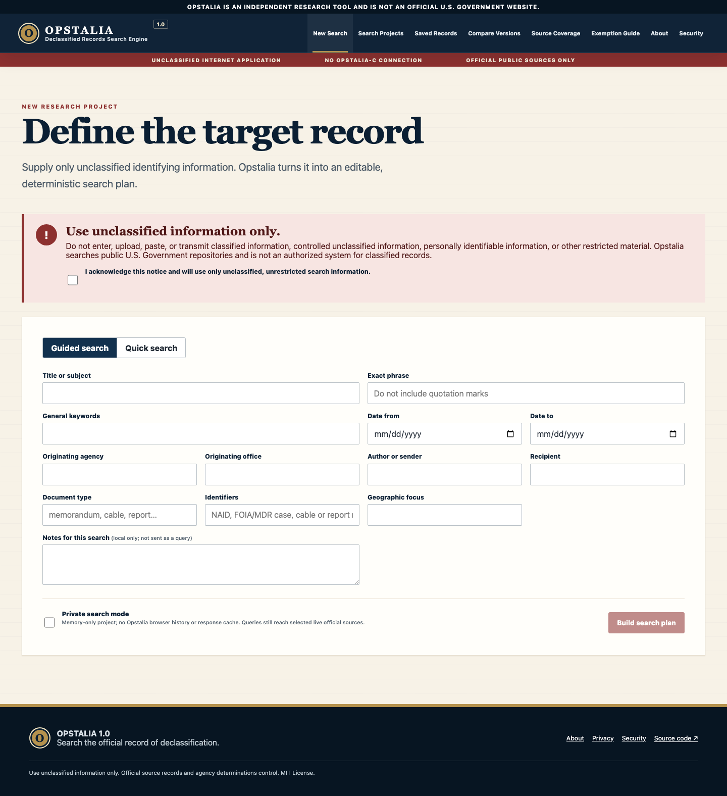
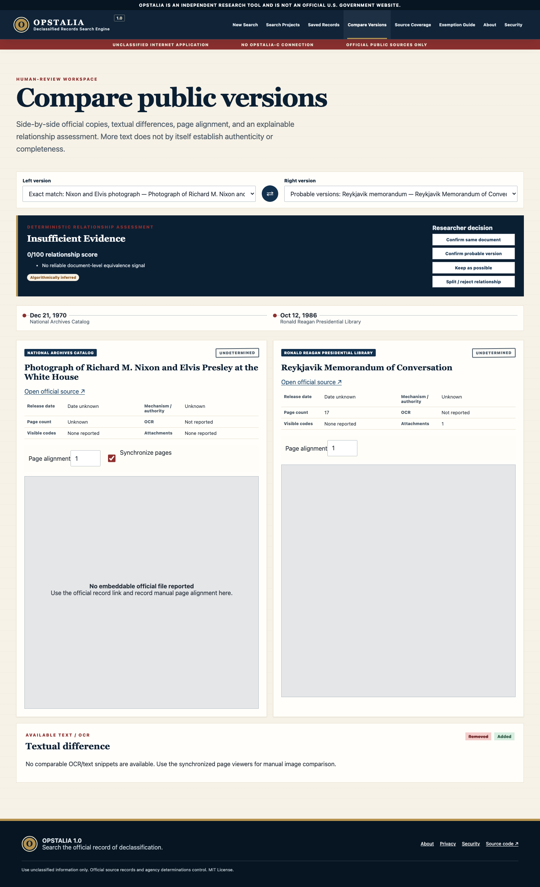

# OPSTALIA 1.0

## Declassified Records Search Engine

**Search the official record of declassification.**

Opstalia is an independent, open-source research tool for determining whether a record described by **unclassified metadata** appears to have been officially released to the public by the United States Government.

> **Use unclassified information only.** Do not enter, upload, paste, or transmit classified information, controlled unclassified information, personally identifiable information, or other restricted material. Opstalia searches public U.S. Government repositories and is not an authorized system for classified records.

Opstalia 1.0 operates only on the regular, unclassified Internet. It has no connection, synchronization, bridge, or network route to **Opstalia-c** or any closed network. A future relationship with Opstalia-c would require separate authorization, engineering, and security review; it is not implemented in this release.

Opstalia is an independent research tool and is not an official U.S. Government website.

## What Opstalia does

Opstalia 1.0 lets a researcher:

- define a target record in a guided form or quick search;
- acknowledge the unclassified-use boundary before building or running a search;
- generate and edit deterministic query variants without a paid AI service;
- run supported official-source searches with failures isolated by source;
- normalize results into a shared, provenance-aware schema;
- rank results with visible scoring factors;
- group possible versions using explainable matching;
- compare two public versions, available text, metadata, and page alignment;
- review, correct, confirm, reject, merge, or split automated interpretations;
- save projects and research judgments in browser-local IndexedDB;
- use a private mode that avoids project persistence;
- export Markdown, CSV, JSON, and printable HTML reports; and
- export and re-import a complete project as JSON.

Every result admitted to the primary result set must have a registered adapter provenance record, an approved official domain, and an official record or file URL.

Project imports receive deep structural and official-domain validation. Because importing does not re-fetch every official source, imported records are visibly marked **Imported · source not revalidated** and cannot claim checked-in fixture status.

## What Opstalia does not do

Opstalia does not:

- accept classified documents or provide a classified-document upload workflow;
- accept CUI, PII, or other restricted information;
- search leaked, hacked, unlawfully obtained, or unofficially disclosed collections;
- search media caches, personal sites, commercial repositories, social-media uploads, crowdsourced archives, anonymous hosts, or unofficial GitHub document copies;
- determine whether information is classified or declassified;
- make legal, disclosure, authenticity, or completeness determinations;
- infer a full release from the absence of visible black boxes;
- claim to search every government system; or
- connect to Opstalia-c.

Absence of a result does not establish that a document has never been released. Government systems may be incomplete, unindexed, temporarily unavailable, or limited to metadata. “Declassified” and “publicly available online” are not synonymous.

## Security warning

The search acknowledgement is an operational boundary, not a classification review. Classification is not removed by transcription, paraphrase, OCR, summarization, or metadata extraction, and Opstalia never claims that AI can determine classification.

The public build contains no source-document upload control. Its Worker search routes accept only validated, size-limited search requests for registered fixed-upstream adapters; the separate health route reports public service metadata, registered adapter IDs, and Boolean secret readiness without revealing a secret. NARA and GovInfo credentials remain Cloudflare Worker secrets named `NARA_API_KEY` and `GOVINFO_API_KEY`; they are never frontend variables. NTRS and OSTI use documented public APIs and require no application secret.

Read [SECURITY.md](SECURITY.md), [PRIVACY.md](PRIVACY.md), [the security model](docs/SECURITY_MODEL.md), and [the threat model](docs/THREAT_MODEL.md) before deployment.

## Supported sources

Registry revision **1.2.0** was validated on **2026-07-30** and contains 35 official-source entries:

| Status | Count | Current behavior |
|---|---:|---|
| Integrated | 2 | National Archives Catalog; Office of the Historian / FRUS |
| Beta | 8 | NARA JFK release-file index; ISCAP; NDC; two NARA record-group profiles; GovInfo; NASA NTRS; OSTI.GOV |
| Temporarily unavailable | 1 | CIA FOIA Electronic Reading Room; prepared terms, official status/publications links, and a retry link are provided |
| Manual search | 20 | Official agency handoffs or reading-room links; no normalized results are claimed |
| Planned | 4 | Registry and official link only |
| Retired | 0 | None |

The automated implementations are deliberately different:

- **National Archives Catalog:** live Catalog API v2 search through a Cloudflare Worker. A working deployment requires `NARA_API_KEY`.
- **CIA records held by NARA — RG 263:** an optional NARA Catalog profile fixed to available-online textual records in Record Group 263. It requires `NARA_API_KEY` and does **not** search the native CIA FOIA Electronic Reading Room.
- **Department of State records held by NARA — RG 59:** an optional NARA Catalog profile fixed to available-online textual records in Record Group 59. It requires `NARA_API_KEY` and does **not** search the native State FOIA Virtual Reading Room or RG 84 Foreign Service Post records.
- **NARA JFK release-file index:** an optional browser-local beta index of the current official NARA “2025 Documents Release” table. It searches exactly **2,709 distinct official PDF rows** by RIF and filename metadata, including records NARA later added to the same page. It does not ingest PDF text or the unofficial Doctly Markdown corpus, and it does not infer a record-specific full release.
- **GovInfo:** a beta Worker adapter for the documented Search Service. It requires a separate server-side `GOVINFO_API_KEY`. A GovInfo publication is official publication evidence, not automatically declassification or full-release evidence.
- **NASA Technical Reports Server:** a beta Worker adapter for official public scientific and technical information. NTRS is not a unified NASA FOIA reading room, and a public result is not proof of declassification or release in full.
- **OSTI.GOV:** a beta Worker adapter for official public DOE-funded scientific and technical information. It is separate from DOE OpenNet and is not proof of declassification or release in full.
- **FRUS:** browser-local search of exactly **752 documents in three volumes** (`frus1981-88v03`, `frus1981-88v05`, and `frus1981-88v06`) built from a pinned official Office of the Historian TEI project snapshot.
- **ISCAP:** browser-local search of exactly **529 release-table objects** built from the official NARA ISCAP releases page.
- **NDC:** browser-local search of exactly **133 entries** from the official FY2026 Q3 release-list workbook. These are generally series-level finding-aid or availability descriptions, not item-level digital records.

The native CIA and Department of State FOIA repositories are **not** automated integrations. For State FOIA, Opstalia creates a user-initiated, prefilled handoff to the official released-document search using applicable terms, dates, sender, recipient, case number, and document type. Opstalia does not fetch or scrape State results. The CIA Reading Room was upstream-unavailable at validation, so Opstalia prepares copyable terms and offers official CIA status/publications links plus a Reading Room retry link; it does not claim to have searched CIA. Results from the separate NARA RG 263 and RG 59 profiles must not be described as results from those native reading rooms. See [SOURCE_COVERAGE.md](docs/SOURCE_COVERAGE.md) for the complete registry and its limitations.

When a researcher finds a record through a manual handoff, Opstalia can record its official URL only after the researcher confirms that the material is unclassified and publicly released. The locator must use HTTPS on an approved official domain and match that adapter's direct record-page or record-file path rules before it can be treated as primary release evidence. A generic search-results, status, home, publications, collection, or other navigation page remains a research lead even when it is on an approved domain; Opstalia does not admit it as primary evidence. Reports label automated searches, manual handoffs, and unavailable sources separately.

Opstalia searches its current registry of supported official repositories.

### NARA attribution

> This product uses the National Archives Catalog API but is not endorsed or certified by the National Archives and Records Administration.

NARA API content is transient: Opstalia does not cache or store NARA API responses. Saving or exporting a project reduces a NARA result to a generated NAID/official-URL locator and researcher-created review data, not the API response, source metadata, API-derived scoring explanation, or automatic NARA-derived version evidence.

To bound untrusted upstream payloads, NARA normalization examines at most 200 reported digital objects per record, 100,000 OCR characters per object, and 500,000 OCR characters across the record. A direct object link is exposed only when it is a file on an approved `archives.gov` host; other reported storage locators are omitted pending an exact host-and-path provenance policy. These are safety limits, not completeness claims.

## Architecture

Opstalia uses a two-part architecture:

1. A React 19, TypeScript, and Vite single-page application is built for the `/opstalia/` base path and hosted on GitHub Pages.
2. A TypeScript Cloudflare Worker dispatches only registered fixed-upstream adapters, holds `NARA_API_KEY` and `GOVINFO_API_KEY` when configured, applies validation, streamed request/response limits, CORS, timeouts, rate limits, and no-store responses, and returns normalized results. The Worker and browser runtime-validate each response and apply official-domain, result/file-URL, source-identity, adapter-provenance, and source-specific record-ID binding checks before a record can enter the primary results index. NTRS and OSTI remain usable without source API secrets.

FRUS, ISCAP, NDC, and the optional NARA JFK release-file manifest are checked-in, same-origin static indexes searched inside the browser. Projects, comparisons, annotations, reports, and preferences are stored in IndexedDB unless private mode is active. No user account or public multi-user database is required.

The source registry and official-domain allowlists live in [`data/sources.json`](data/sources.json). Shared TypeScript entities live in [`src/core/types.ts`](src/core/types.ts), and input-boundary validation lives in [`src/core/validation.ts`](src/core/validation.ts).

See:

- [Architecture and decision record](docs/ARCHITECTURE.md)
- [Data model](docs/DATA_MODEL.md)
- [Source-adapter guide](docs/SOURCE_ADAPTERS.md)
- [Deployment guide](docs/DEPLOYMENT.md)

## Local development

Prerequisites:

- Node.js 22.13 or later;
- npm;
- a Cloudflare account and Wrangler login only if running the live Worker; and
- a NARA Catalog API key only if testing live NARA or NARA-profile search; and
- a GovInfo API key only if testing live GovInfo search.

Install and start the frontend:

```bash
git clone https://github.com/therealjameswilson/opstalia.git
cd opstalia
npm ci
npm run dev
```

The frontend runs at `http://localhost:5173/`. The four checked-in local indexes work without a Worker or API key.

To test the local Worker, create an ignored `worker/.dev.vars` file:

```dotenv
NARA_API_KEY=replace-with-your-local-development-key
GOVINFO_API_KEY=replace-with-your-local-development-key
RATE_LIMIT_SALT=replace-with-a-random-local-value
FRONTEND_ORIGIN=http://localhost:5173
APP_ENV=development
```

Then set the public local Worker URL in an ignored `.env.local`:

```dotenv
VITE_API_BASE=http://127.0.0.1:8787
```

Run the Worker and frontend in separate terminals:

```bash
npm run worker:dev
```

```bash
npm run dev
```

Never commit `.dev.vars`, `.env.local`, an API key, or any other secret.

## API secrets

`VITE_` variables are compiled into public browser JavaScript. **Never put `NARA_API_KEY`, `GOVINFO_API_KEY`, or another credential in a `VITE_` variable.**

Install the production NARA key directly into Cloudflare’s secret store:

```bash
npx wrangler secret put NARA_API_KEY --config worker/wrangler.toml
```

Install the production GovInfo key only if GovInfo search should be enabled:

```bash
npx wrangler secret put GOVINFO_API_KEY --config worker/wrangler.toml
```

Wrangler prompts for the value without requiring it in source or a command-line argument. A production rate-limit salt should also be installed as a secret:

```bash
npx wrangler secret put RATE_LIMIT_SALT --config worker/wrangler.toml
```

The health endpoint reports only Boolean readiness for NARA and GovInfo secrets; it never returns either value. The Worker itself remains useful without either source key because the public NTRS and OSTI adapters require no application secret.

## Deployment

The frontend deployment target is:

<https://therealjameswilson.github.io/opstalia/>

The Worker URL is created by Cloudflare and must be verified from Wrangler’s deployment output. This repository does not invent or publish an unverified backend URL. After deployment, place the verified URL in the GitHub Actions repository variable `VITE_API_BASE`.

The safe order is below. Omit a source-key command only when that keyed adapter is intentionally disabled; the Worker itself and the NTRS/OSTI adapters do not require either source key.

```bash
npm ci
npm run check
npm run secret:scan
npm run worker:deploy
npx wrangler secret put NARA_API_KEY --config worker/wrangler.toml
npx wrangler secret put GOVINFO_API_KEY --config worker/wrangler.toml
npx wrangler secret put RATE_LIMIT_SALT --config worker/wrangler.toml
```

Then configure the public Worker URL and trigger the frontend workflow:

```bash
gh variable set VITE_API_BASE \
  --repo therealjameswilson/opstalia \
  --body "https://VERIFIED-WORKER-URL"
git push origin main
```

The frontend still builds when `VITE_API_BASE` is absent. In that state all Worker-backed sources are unavailable, while FRUS, ISCAP, NDC, the optional NARA JFK index, and manual workflows continue to work. With a Worker URL but no source keys, the opt-in NTRS and OSTI adapters remain usable; NARA reports its missing-key state, while either NARA record-group profile and GovInfo report their respective missing-key state when the researcher selects them. Backend deployment is therefore not a precondition for a successful static frontend build.

Full Cloudflare, GitHub Pages, Actions-variable, readiness, and verification instructions are in [DEPLOYMENT.md](docs/DEPLOYMENT.md).

## Testing

Run the full local quality gate:

```bash
npm run check
```

Run individual suites:

```bash
npm run lint
npm run typecheck
npm run test:unit
npm run test:integration
npm run test:security
npm run test:e2e
npm run test:a11y
npm run build
npm run audit
npm run secret:scan
```

Vitest tests use recorded fixtures rather than consuming live API quota in normal CI. Playwright runs desktop Chromium and a mobile profile against the production-base-path preview.

## Source-adapter development

Source definitions belong in [`data/sources.json`](data/sources.json); do not scatter domain allowlists across UI code. A backend adapter implements the shared `SourceAdapter` contract in [`worker/src/adapters/types.ts`](worker/src/adapters/types.ts). Client-side pinned-index adapters are isolated in [`src/search/local-adapters.ts`](src/search/local-adapters.ts).

Before marking an adapter automated:

1. validate the official endpoint, terms, robots guidance, authentication, and rate limits;
2. add exact official domains and a manual fallback to the registry;
3. preserve the raw record when policy permits;
4. normalize fields with per-field source, extraction method, and confidence;
5. reject results that fail registered-domain and provenance validation;
6. add recorded integration fixtures and partial-failure tests; and
7. document the actual coverage boundary.

Refresh checked-in indexes only through their builders:

```bash
npm run indexes:frus
npm run indexes:iscap
npm run indexes:ndc
npm run indexes:jfk-2025
```

These commands access official public sources and may change generated data. Review record counts, provenance metadata, source hashes or pinned commit, and diffs before committing.

## Known limitations

- Live NARA search is unavailable until a Worker URL and `NARA_API_KEY` are configured.
- GovInfo search is unavailable until a Worker URL and `GOVINFO_API_KEY` are configured.
- NARA RG 263/RG 59 profiles search NARA-held records only; they do not automate native CIA or State FOIA systems.
- NTRS and OSTI are official scientific/publication discovery sources, not declassification or full-release determinations.
- FRUS coverage is 752 documents in three volumes, not the complete FRUS series.
- ISCAP and NDC searches use build-time snapshots, not live runtime queries.
- The opt-in NARA JFK adapter is filename/RIF search over a mutable official release-page snapshot, not full-text search or complete JFK Collection coverage. The current NARA table reports March 18, 2025 for every row even though the page now includes later batches, so Opstalia does not infer per-file batch membership from that value.
- Opstalia does not ingest or present the unofficial Doctly JFK corpus as official release evidence.
- The 133 NDC entries are generally finding-aid or series-level descriptions and may report that records are not online.
- State FOIA is a user-initiated, prefilled official-search handoff, not an automated adapter; CIA Reading Room search is temporarily unavailable upstream.
- Official search indexes and OCR may be incomplete.
- Textual redaction-marking detection is deterministic and probabilistic; it requires human review.
- The current image routine is a limited dark-region primitive, not a production claim of page-level redaction recognition.
- Synchronized document frames support manual page alignment, but cross-origin viewer behavior depends on the official source.
- Printable HTML is provided; a dedicated PDF-generation dependency is not included.
- Private mode prevents Opstalia persistence but is not anonymous. The selected live source still receives the query needed to search.
- A more complete-looking copy is not presumed authentic or complete.

See [KNOWN_LIMITATIONS.md](docs/KNOWN_LIMITATIONS.md) for the maintained limitations statement.

## Relationship to NARA Scout

**Opstalia was developed from concepts first implemented in NARA Scout.**

[NARA Scout](https://therealjameswilson.github.io/nara-scout/) remains a specialized FRUS research-planning tool. Opstalia is a separate repository and application with a federated source registry, normalized records, cautious release-status analysis, deterministic version relationships, and a broader human-review workflow. The NARA Scout repository is not modified by this project.

## Screenshots

The screenshots below show the production frontend build with the Worker intentionally unconfigured. The dashboard therefore labels the backend **Setup** instead of presenting NARA as live.

### Research dashboard


### Unclassified search form



### Version-comparison workspace



## Roadmap

Priorities after 1.0 include:

- expand the reproducibly pinned FRUS coverage;
- revalidate and, if a stable official interface permits, automate native CIA and State FOIA search without conflating them with NARA-held records;
- expand documented official APIs only where the corpus and evidentiary meaning can be labeled precisely;
- strengthen page-image redaction overlays and manual correction;
- improve attachment, missing-page, and marginal-marking comparison;
- add an optional, stable PDF-report path; and
- separately evaluate a future local analyst and Opstalia-c relationship only inside an authorized environment after explicit security review.

Nothing on that roadmap changes the 1.0 boundary: the public application is unclassified, Internet-only, and disconnected from Opstalia-c.

## License

Opstalia is released under the [MIT License](LICENSE).
