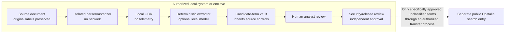

# Future Opstalia Local Analyst mode

Status: **architecture concept only — disabled and not deployed**

## Current 1.0 boundary

Opstalia 1.0 is a purely unclassified application on the regular Internet. It
accepts unclassified metadata and sanitized search terms only. It has no
document-upload control, document-ingestion service, local OCR workflow, or
classified-processing authorization.

Opstalia 1.0 does not connect or synchronize with **Opstalia-c**. There is no
bridge, connector, shared database, shared identity, transfer agent, export
automation, cross-domain service, endpoint, credential, or network route.

This document does not authorize development, deployment, testing with
restricted data, or synchronization. It records what a future, separately
reviewed design would have to prove.

## Why a separate local mode might exist

A future Local Analyst mode could help an authorized researcher derive candidate
search metadata from a source document without sending that document to an
external service. Candidate outputs might include:

- likely title;
- document date;
- originating agency and office;
- sender and recipient;
- document type;
- control, cable, memorandum, report, case, or archival identifiers;
- names and geographic terms; and
- candidate phrases suitable for a public official-repository search.

These are candidate research aids. Extraction does not establish that a term is
unclassified or approved for Internet transmission.

## Non-negotiable rules

A future Local Analyst module must:

1. run only on a system and network authorized for the highest classification
   and handling category of the source material;
2. be absent or compile-time disabled in the public build;
3. never send source-document bytes, text, OCR, images, thumbnails, embeddings,
   prompts, tokens, summaries, metadata, or telemetry to an external API;
4. use locally installed OCR, parsing, and optional model components with
   outbound networking disabled;
5. separate the source document from extracted candidate search terms;
6. require a human security review before any candidate term crosses to a
   lower-classification or public environment;
7. preserve original classification and handling labels throughout processing;
8. display that classification is not removed by transcription, OCR,
   paraphrase, summarization, translation, metadata extraction, or AI output;
9. never claim that AI, OCR, rules, or Opstalia can determine classification;
10. default to no export and no synchronization;
11. require explicit authorization, accreditation, threat assessment, and
    operating procedures before real material is processed; and
12. preserve an auditable distinction between machine extraction, human
    correction, security release review, and public search activity.

An acknowledgement checkbox is not a cross-domain control and is not sufficient
authorization.

## Proposed separation architecture

The dotted line is not a software sync. It represents a future, organization-
approved transfer procedure. Until that procedure exists and is authorized,
the boundary is closed.

## Data zones

### Source zone

Contains the original document, page images, embedded objects, native metadata,
parser output, OCR, and any local-model context. Everything in this zone
inherits the source document's classification and handling requirements unless
an authorized authority determines otherwise.

### Candidate zone

Contains extracted names, dates, identifiers, phrases, confidence, page
locations, and provenance. Candidate data remains governed by the source
material. Merely selecting fewer words does not make the output unclassified.

### Reviewed-output zone

Contains only individual terms explicitly approved by an authorized reviewer
for the intended destination and use. The approval record must identify:

- reviewer and authority;
- source document identifier without unnecessary content;
- each approved term or field;
- destination and purpose;
- date and expiration/re-review requirement;
- applicable handling caveats; and
- the approved transfer mechanism.

### Public search zone

Is the existing Opstalia 1.0 Internet application. It must receive only the
approved unclassified terms, not the source, OCR, candidate vault, reasoning
trace, or higher-side audit record.

## Local processing design

### Ingestion

- Require explicit source classification and handling labels before opening the
  file.
- Reject a file whose status or system authorization is unknown.
- Record a cryptographic hash, size, format, page count, and ingestion time.
- Never modify the original evidence file.
- Process copies in a designated temporary workspace.

### Malicious-document controls

- Sniff content and reject extension/MIME mismatches, encrypted or unsupported
  documents, archives, polyglots, and malformed files.
- Apply byte, expanded-byte, object, page, image-dimension, font, CPU, memory,
  and wall-clock limits.
- Disable document JavaScript, actions, forms, attachments, media, external
  references, callbacks, and macros.
- Parse and rasterize in an unprivileged, disposable sandbox with no network,
  ambient credentials, clipboard, or arbitrary filesystem access.
- Maintain malware scanning and parser/rasterizer patch procedures appropriate
  to the enclave.

### OCR and extraction

- Use local binaries and local model weights only.
- Disable analytics, crash uploads, package-manager callbacks, update checks,
  remote fonts, model downloads, and certificate/telemetry calls during
  processing.
- Record engine/model version, configuration, page coordinates, and confidence.
- Keep raw OCR distinct from corrected text and extracted fields.
- Prefer deterministic identifiers and date/name parsing before an optional
  local generative model.
- Treat generated expansions as untrusted candidate data.

### Storage

- Encrypt authorized storage according to the environment's policy.
- Apply role-based access, least privilege, session locking, and separation of
  analyst, reviewer, and administrator duties.
- Define retention for originals, working files, OCR, model context, candidate
  terms, approved output, and audit events.
- Securely dispose of temporary data according to the approved media and
  storage procedure.
- Do not reuse candidate data for model training, evaluation, telemetry, or
  unrelated research without separate authorization.

### Audit

Audit records should contain actions and provenance, not unnecessary source
content. Record:

- source hash/identifier and labels;
- tool/version/configuration;
- extraction and human correction events;
- reviewer decision and authority;
- exact approved terms;
- transfer event and destination; and
- later revocation or correction.

Logs inherit the sensitivity of their contents and must never be sent to a
public issue tracker or Internet logging service.

## Human review workflow

1. An authorized analyst ingests the document locally.
2. Local tools produce candidate fields with page-level provenance.
3. The analyst corrects extraction errors but cannot downgrade the data.
4. A separate authorized reviewer evaluates each candidate term for the
   specific intended disclosure/search.
5. Unclear terms are withheld from transfer.
6. The approved term set is exported through the organization's authorized
   mechanism.
7. The researcher enters or imports only those approved terms into the public
   Opstalia search.
8. Public search results return only to the public environment unless a
   separately authorized transfer process exists.

The reviewer must not rely on a model's statement that a term is safe.

## Possible future Opstalia-c relationship

At some later point, an authorized owner may consider synchronization with a
closed-network Opstalia-c. That is a new cross-domain architecture, not an
incremental feature.

Before any implementation, it would require:

- named system owners and authorizing officials for both environments;
- data classification and handling rules for every field and direction;
- a formal cross-domain solution or approved transfer procedure;
- explicit one-way/two-way flow analysis;
- content filters that fail closed;
- human release review where required;
- protocol, identity, key, replay, rollback, and revocation design;
- malware and data-smuggling analysis;
- audit reconciliation;
- incident response and kill-switch procedures;
- independent penetration and security testing; and
- documented authorization to operate.

A direct Internet-to-closed-network socket, shared cloud database, shared
clipboard, shared browser profile, ordinary sync folder, email automation,
consumer file-sharing service, or generic API gateway would not satisfy this
requirement.

The safest default is no connection. If a future approved exchange exists, the
public 1.0 repository must continue to work without it and must not contain
closed-network endpoints, credentials, schemas that expose sensitive fields, or
fallback routes.

## Model-specific safeguards

If a local model is proposed:

- it must execute entirely in the authorized environment;
- weights, tokenizer, runtime, and dependencies must be obtained and reviewed
  through the environment's approved supply chain;
- prompts, outputs, context, caches, crash dumps, and telemetry remain local;
- model memory/state must not persist across matters unless explicitly
  authorized;
- retrieved context must respect access control and need to know;
- outputs must be visibly labeled machine-generated candidates;
- prompt injection in source documents must be treated as untrusted text, not
  instructions; and
- the model must never be asked or allowed to certify classification,
  declassification, release authority, legal privilege, or transfer approval.

An optional model is not necessary for deterministic extraction and should not
be introduced unless it materially improves a reviewed use case.

## Required review artifacts

Before a prototype sees real material:

- system boundary and data-flow diagrams;
- data inventory and classification guide;
- threat model and privacy assessment;
- malicious-file test plan;
- dependency/software bill of materials;
- parser, OCR, and model configuration baselines;
- network-denial test evidence;
- storage, backup, media, and disposal procedures;
- access-control and separation-of-duties matrix;
- transfer/release-review procedure;
- incident response and spill procedure;
- log and retention design;
- test corpus consisting only of approved material; and
- written authorization for the environment and use case.

Before any Opstalia-c exchange, add the cross-domain authorization and test
evidence identified above.

## Public-build exclusion tests

Opstalia 1.0 release tests should continue to confirm:

- there is no document/image upload control or route;
- no local analyst bundle, parser, OCR engine, or model weight is shipped;
- no Opstalia-c hostname, endpoint, secret, credential, or sync code exists;
- no source document or extracted content is sent to an external API;
- UI and reports state the unclassified-only boundary;
- classification-removal disclaimers remain visible; and
- any link to this document says "future" and "not deployed."

## Decision rule

If a requested feature would let the public build see a source document,
extract content from a restricted record, or exchange data with a closed
network, stop. Treat it as a new system requiring authority and review; do not
approximate the feature with a disclaimer.
