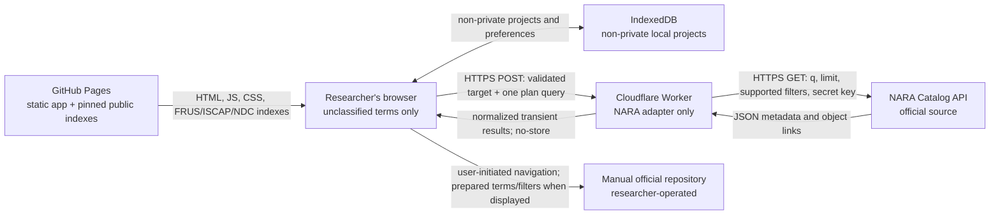
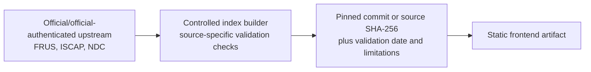

# Opstalia 1.0 security model

Status: public-release model
Last reviewed: 2026-07-29

## Executive boundary

Opstalia 1.0 is a purely unclassified research application deployed on the
regular Internet. It is not an authorized information system for:

- classified information at any level;
- controlled unclassified information;
- personally identifiable information;
- export-controlled, law-enforcement-sensitive, procurement-sensitive, or
  otherwise restricted information; or
- a source document whose handling status is uncertain.

The public application accepts unclassified metadata and sanitized search terms
only. It does not accept document uploads.

There is no connection, bridge, shared identity, shared datastore,
synchronization protocol, message queue, export automation, or network route
between Opstalia 1.0 and **Opstalia-c**. Opstalia-c is a possible future
closed-network concept, not a component or environment of the 1.0 system.

OCR, transcription, paraphrase, summarization, translation, metadata
extraction, or model output cannot remove classification or change handling
requirements. Opstalia does not make classification, declassification, legal,
authenticity, or disclosure determinations.

## Security objectives

The system is designed to:

1. keep credentials out of the public frontend, repository, artifacts, logs,
   and responses;
2. send only unclassified search data needed for a selected official source;
3. admit primary evidence only through registered adapters and approved
   official domains;
4. prevent a source failure from expanding the search to unofficial sources;
5. minimize retention, particularly for NARA Catalog API responses;
6. keep researcher projects local by default and offer a memory-only mode;
7. preserve provenance and make algorithmic inferences visible and correctable;
8. render untrusted source text as inert text;
9. limit request size, rate, duration, and outbound destinations; and
10. state residual risk without claiming anonymity or authorization.

Availability of every government repository, exhaustive discovery, and
protection against a user intentionally entering restricted material are not
security objectives the public application can guarantee.

## Production components

| Component | Runs where | Function | Persistent application data |
| --- | --- | --- | --- |
| React/Vite frontend | GitHub Pages and the user's browser | Search planning, local-index search, normalization display, comparison, human review, and exports | Projects and preferences in IndexedDB when private mode is off |
| FRUS index | Static GitHub Pages asset | Pinned TEI-derived search index for three documented FRUS volumes | Checked-in public build artifact |
| ISCAP index | Static GitHub Pages asset | Pinned official release-table index | Checked-in public build artifact |
| NDC index | Static GitHub Pages asset | Pinned official release-list index | Checked-in public build artifact |
| Cloudflare Worker | Cloudflare edge | Validate and proxy NARA Catalog searches; keep the API key server-side | None configured; an ephemeral in-memory rate-limit map |
| NARA Catalog API | NARA | Official Catalog search and metadata | Controlled by NARA |
| Manual official sources | Source agencies | Researcher-directed search or viewing | Controlled by each source |

The Worker has no KV namespace, D1 database, R2 bucket, Durable Object, queue, or
application analytics binding. Worker observability is disabled in the checked
configuration.

## Data-flow diagrams

### Runtime search



### Build-time source refresh



The build path is not an online search path. A checked-in index can become stale
and must retain its source commit/hash, generation time, stated coverage, and
known limitations.

## Exact NARA request path

For each of at most the first three enabled NARA plan queries:

1. The browser constructs a `NormalizedSearchQuery` containing the unclassified
   target, one editable plan query, a result limit, an optional cursor, and the
   private-mode flag. Before transmission it explicitly removes the target's
   research-notes field.
2. The browser POSTs JSON to `/api/search/nara` on the configured Worker with
   `cache: "no-store"` and no credentials.
3. The Worker:
   - rejects an unapproved `Origin`;
   - requires JSON;
   - rejects a declared or actual body larger than 16 KiB;
   - validates field types and bounds;
   - applies a 30-request-per-minute in-memory limiter keyed by a truncated hash
     derived from the Cloudflare-provided address and `RATE_LIMIT_SALT`;
   - applies a 15-second adapter timeout; and
   - never writes the request body or address to an application log.
4. The NARA adapter constructs a URL at the fixed endpoint
   `https://catalog.archives.gov/api/v2/records/search`.
5. It forwards:
   - `q` and a maximum result limit of 50;
   - a NAID when an identifier query supplies one;
   - supported start/end date, exact title, creator, geography, and material
     type filters; and
   - `NARA_API_KEY` in the upstream API-key header.
6. Target notes and researcher annotations reach neither the Worker nor NARA.
   Private-mode state reaches the Worker as a request flag but is not a NARA
   query parameter; the Worker already applies its no-store policy to every
   search.
7. Transient response data is normalized, scored, and checked for visible
   marking strings. The Worker returns normalized records without raw NARA
   response objects.
8. The response carries `Cache-Control: no-store, private, max-age=0`.

The frontend origin is a scheme/host origin, not a GitHub Pages path. Production
CORS therefore allows `https://therealjameswilson.github.io`; the application
path remains `/opstalia/`.

## Local-index request path

FRUS, ISCAP, and NDC indexes are fetched as same-origin static frontend assets
and kept in the page's in-memory index map. Search terms are matched inside the
browser. No runtime query is sent to history.state.gov or archives.gov for
these adapters.

- The FRUS artifact records its source project, pinned commit, covered volumes,
  generation time, and limitations. Canonical evidence links point to
  `history.state.gov`; build provenance is not substituted for the official
  document page.
- ISCAP and NDC artifacts record their official source URL and source SHA-256.
- The ISCAP and NDC builders validate expected structure and refuse
  unexpectedly small or malformed inputs; the FRUS builder uses a fixed
  upstream and pinned commit.
- Source limitations remain visible in source runs.

## Manual-source path

Manual adapters do not scrape or normalize a result. They expose registered
official URLs, prepared terms, and limitations. For State FOIA, the displayed
official URL contains supported plan fields; selecting it performs an ordinary
browser navigation and transmits those values to State. For CIA, the terms
remain copyable while the official Reading Room is unavailable. Nothing opens
automatically, and the local research-notes field is never included.

A manually discovered locator enters a project only after the researcher
confirms that it identifies an unclassified, publicly released record. The URL
must pass the selected adapter's HTTPS official-domain allowlist and a
source/path rule: CIA Reading Room record pages/files, State FOIA
`/DOCUMENTS/…` PDFs, FBI Vault downloads, or direct record files for other
manual adapters. Domain-valid home, search, status, and publications pages are
rejected. Opstalia stores researcher-confirmed locator metadata and does not
fetch the document.

## Trust boundaries

### Browser and local device

The browser is both an execution environment and a user-controlled boundary.
Opstalia assumes a supported, patched browser but does not assume that
extensions, enterprise monitoring, synchronization, local malware, shared
accounts, or device backups are absent.

IndexedDB improves local ownership; it is not encryption, an enclave, or a
classification control.

### GitHub Pages

GitHub Pages supplies immutable-at-build application assets. Its ordinary
access and security telemetry is outside Opstalia application control. All
GitHub Pages project sites on the same scheme and hostname share a web origin,
which is why Opstalia storage must never hold secrets or restricted material.

### Cloudflare

Cloudflare terminates the Worker HTTPS request and makes network metadata
available to the Worker. Application code uses an address-derived hash for rate
limiting but does not log or durably store the address. Cloudflare may maintain
independent infrastructure records.

### Official repositories

Official repositories are authoritative for their own records and
determinations but are not assumed to be available, complete, uniformly
indexed, safe to embed, or semantically consistent.

### Build dependencies and upstream sources

Package registries, GitHub-hosted official source projects, official web pages,
and release workbooks are supply-chain boundaries. A domain or repository name
does not remove the need for a pinned version, source hash, schema check, code
review, and reproducible build.

## Information model and provenance controls

Every primary normalized record must have:

- a registered source ID and matching adapter ID;
- an approved official domain drawn from the source registry;
- an HTTPS official record or file URL;
- a retrieval timestamp;
- a normalization version; and
- field-level source, extraction method, and confidence where the field model
  supports them.

`validatePrimaryEvidence` rejects a missing source, mismatched provenance,
non-HTTPS URL, out-of-registry domain, or missing official URL. Subdomains are
allowed only beneath the registry entry's configured domain. Adapter code does
not get to silently expand the registry.

This gate establishes source eligibility, not authenticity or completeness.
A researcher must still inspect the official page, document, context, and
release legend.

## Release-status safety

The controlled vocabulary is:

- `released_in_full`
- `released_in_part`
- `released_with_redactions_status_unclear`
- `metadata_only`
- `described_but_not_digitized`
- `withdrawal_notice_only`
- `finding_aid_only`
- `not_determined`

Automatic `released_in_full` requires explicit official full-release language.
A researcher may override status with a recorded basis. A public digital object
with no visible redaction is otherwise `not_determined`; absence of a visible
black box is not full-release evidence.

Release markings, match scores, and version relationships remain inferences
with visible reasons and human-review controls.

## Secret management

### Secret

`NARA_API_KEY` is installed only through:

```sh
wrangler secret put NARA_API_KEY --config worker/wrangler.toml
```

It must never be:

- named with a `VITE_` prefix;
- placed in `.env.example`, `.dev.vars`, or Wrangler configuration committed to
  the repository;
- echoed by CI or deployment scripts;
- returned by `/api/health` or an error route;
- present in screenshots, fixtures, source maps, reports, or issue text; or
- copied from NARA Scout or any other repository.

The health response exposes only `naraSecretConfigured: true|false`.

### Non-secret configuration

`VITE_API_BASE`, `FRONTEND_ORIGIN`, `APP_ENV`, and the Worker URL are public
deployment metadata. `RATE_LIMIT_SALT` should be a Worker secret in production
because predictability weakens its usefulness, although it does not replace a
credential or identity system.

### Error handling

Known API-key, authorization, Cloudflare-token, and NARA-secret patterns are
replaced before an error is returned. External source errors are normalized and
truncated. Application code must not add body or header logging around these
paths.

## Storage and retention

### Backend

The Worker does not persist searches, notes, source responses, or results.
Its current limiter is in a module-level map and therefore:

- is ephemeral per Worker isolate;
- is not a durable user record;
- can be reset by isolate lifecycle; and
- is not a globally consistent abuse-prevention system.

### Browser

Non-private projects use a namespaced IndexedDB database. Private projects do
not call the persistence layer.

To comply with the source registry and current [NARA Catalog API
terms](https://www.archives.gov/research/catalog/help/api):

- raw NARA records are excluded;
- a persisted NARA result becomes a locator containing the NAID and official
  URL plus researcher-created review data; and
- reports/project exports must apply the same locator sanitizer before writing
  a user file.

FRUS, ISCAP, and NDC records are based on checked-in public artifacts and may be
saved with provenance.

### Private mode

Private mode is memory-only at the Opstalia project layer. Reloading or closing
the tab discards the active workspace. It neither anonymizes the request nor
disables ordinary static-asset caching, browser history outside Opstalia,
downloads, provider logs, or device monitoring.

## Browser security

- Search and OCR strings are rendered through React text nodes.
- Exported printable HTML escapes `&`, `<`, and `>`.
- CSV formula-prefix protection is applied.
- External links open with `noopener noreferrer`.
- The comparison viewer uses a sandboxed iframe for approved official file
  URLs.
- The frontend's meta Content Security Policy restricts scripts, connections,
  images, frames, objects, base URLs, and form actions.

A meta CSP does not provide every protection of an HTTP response-header CSP;
notably, clickjacking control should use a hosting response header when
available. GitHub Pages also limits control over security headers. The CSP is
therefore defense in depth, not an authorization boundary.

## File handling

The public build has no PDF or document upload. Project JSON is the only file
input and is read locally, limited to 20 MB, deeply structurally validated, and
checked against the registered source and official-domain allowlists. Import
does not re-fetch each source, so fixture claims are cleared and imported
provenance remains visibly marked as not revalidated.

Official PDFs shown in the comparison workspace are fetched by the browser from
an approved official URL. They are not fetched or parsed by the Worker.
Official provenance does not make a file non-malicious. See
[`REDACTION_ANALYSIS.md`](REDACTION_ANALYSIS.md) and
[`THREAT_MODEL.md`](THREAT_MODEL.md).

## Operational verification

Before release:

1. run lint, TypeScript checks, unit/integration/security tests, and a production
   build;
2. run the repository secret scanner and inspect the full Git history;
3. search source, source maps, and built JavaScript for `NARA_API_KEY`,
   API-key-like strings, and authorization headers;
4. verify the Worker origin allowlist in production;
5. confirm `/api/health` reveals only readiness;
6. confirm NARA requests and responses use `no-store`;
7. verify NARA persistence and every export are locator-only;
8. run malicious-URL, unofficial-domain, SSRF, JSON-size, OCR-XSS, CSV-injection,
   CORS, timeout, and rate-limit tests;
9. verify the deployed frontend uses the intended Worker URL and the Worker
   uses the intended frontend origin;
10. compare deployed artifacts with the release commit; and
11. confirm the visible unclassified-use notice and acknowledgement cannot be
   bypassed through the normal search workflow.

## Incident response

If a secret is suspected exposed:

1. revoke or rotate it at the issuing service;
2. remove it from the deployment and repository history without printing it;
3. inspect builds, source maps, CI output, and Worker responses;
4. redeploy from a clean reviewed commit; and
5. document the unclassified incident without reproducing the secret.

If restricted information may have been entered, do not ask the user to send a
copy. Direct them to stop, preserve or clear state only as their organizational
procedure requires, and contact the appropriate security authority. Opstalia
is not an incident-management or classification-review system.

## Future changes that require security review

The following are architecture changes, not ordinary features:

- any document or image upload;
- PDF fetching or server-side parsing;
- OCR not supplied by an official source;
- an AI or external query-generation provider;
- user accounts, collaboration, or public multi-user storage;
- backend storage, analytics, or query caching;
- a new automated source adapter or broader outbound host allowlist;
- a cross-origin embed outside the current registry;
- synchronization, export automation, or any network relationship with
  Opstalia-c; or
- a local analyst mode that can see source-document content.

The future local concept and required safeguards are documented in
[`FUTURE_LOCAL_ANALYST.md`](FUTURE_LOCAL_ANALYST.md). It is not part of the
public deployment.
