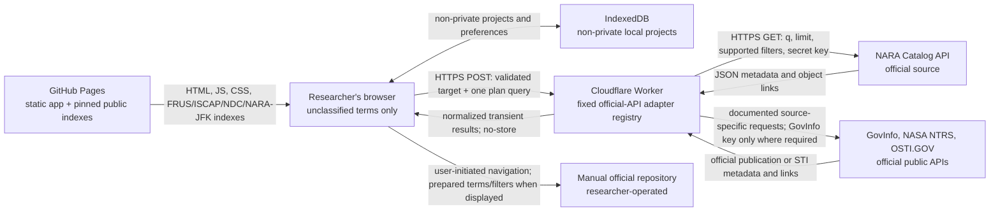
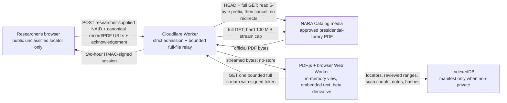
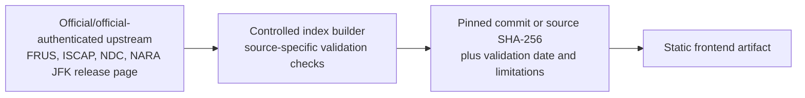

# Opstalia 1.0 security model

Status: public-release model
Last reviewed: 2026-08-03

## Executive boundary

Opstalia 1.0 is a purely unclassified research application deployed on the
regular Internet. It is not an authorized information system for:

- classified information at any level;
- controlled unclassified information;
- personally identifiable information;
- export-controlled, law-enforcement-sensitive, procurement-sensitive, or
  otherwise restricted information; or
- a source document whose handling status is uncertain.

The public application accepts unclassified metadata and sanitized search terms
only. It does not accept document uploads. Its beta PDF Packet Lab accepts only
an acknowledged public NARA Catalog locator and retrieves the corresponding
official presidential-library PDF through a narrow bounded full-file relay; it does not
accept an arbitrary URL, local file, pasted document, or uncertain source.

There is no connection, bridge, shared identity, shared datastore,
synchronization protocol, message queue, export automation, or network route
between Opstalia 1.0 and **Opstalia-c**. Opstalia-c is a possible future
closed-network concept, not a component or environment of the 1.0 system.

OCR, transcription, paraphrase, summarization, translation, metadata
extraction, or model output cannot remove classification or change handling
requirements. Opstalia does not make classification, declassification, legal,
authenticity, or disclosure determinations.

## Security objectives

The system is designed to:

1. keep credentials out of the public frontend, repository, artifacts, logs,
   and responses;
2. send only unclassified search data needed for a selected official source;
3. admit primary evidence only through registered adapters and approved
   official domains;
4. prevent a source failure from expanding the search to unofficial sources;
5. minimize retention, particularly for NARA Catalog API responses;
6. keep researcher projects local by default and offer a memory-only mode;
7. preserve provenance and make algorithmic inferences visible and correctable;
8. render untrusted source text as inert text;
9. limit request size, rate, duration, and outbound destinations; and
10. confine presidential-library PDF access to one exact official path, keep PDF
    parsing in a constrained browser context, and persist manifests rather than
    source bytes; and
11. state residual risk without claiming anonymity or authorization.

Availability of every government repository, exhaustive discovery, and
protection against a user intentionally entering restricted material are not
security objectives the public application can guarantee.

## Production components

| Component | Runs where | Function | Persistent application data |
| --- | --- | --- | --- |
| React/Vite frontend | GitHub Pages and the user's browser | Search planning, local-index search, normalization display, comparison, human review, PDF.js packet viewing/text-layer scanning, and exports | Projects, preferences, and packet manifests in IndexedDB when private mode is off; no PDF bytes, rendered pages, extracted page text, or relay tokens |
| FRUS index | Static GitHub Pages asset | Pinned TEI-derived search index for three documented FRUS volumes | Checked-in public build artifact |
| ISCAP index | Static GitHub Pages asset | Pinned official release-table index | Checked-in public build artifact |
| NDC index | Static GitHub Pages asset | Pinned official release-list index | Checked-in public build artifact |
| NARA JFK release-file index | Static GitHub Pages asset | Pinned official filename/RIF manifest with NARA PDF links | Checked-in public build artifact; no PDF or Doctly text |
| Cloudflare Worker | Cloudflare edge | Dispatch fixed official-API adapters; keep NARA and GovInfo keys server-side; mediate NTRS/OSTI CORS; admit and stream one exact NARA presidential-library PDF path through short-lived signed sessions | None configured; an ephemeral in-memory rate-limit map; no PDF store or cache |
| NARA Catalog API | NARA | Official Catalog search and metadata | Controlled by NARA |
| NARA Catalog presidential-library media | NARA | Official public PDF bytes for an admitted `catalog.archives.gov/medialz/presidential-libraries/…pdf` locator | Controlled by NARA |
| GovInfo Search Service | Government Publishing Office | Official publication discovery | Controlled by GPO |
| NASA NTRS and OSTI.GOV APIs | NASA and DOE OSTI | Official public scientific and technical information discovery | Controlled by each agency |
| Manual official sources | Source agencies | Researcher-directed search or viewing | Controlled by each source |

The Worker has no KV namespace, D1 database, R2 bucket, Durable Object, queue, or
application analytics binding. Worker observability is disabled in the checked
configuration.

## Data-flow diagrams

### Runtime search



### PDF Packet Lab



No source PDF is uploaded to Opstalia. Admission reads only the `%PDF-` prefix
from its GET response and cancels the rest. Opening then streams one complete
copy from the approved NARA host through Cloudflare into browser memory; creating
a derivative streams a second complete copy. Worker application code does not
parse, OCR, transform, index, cache, store, or log those bytes. Provider
infrastructure may retain ordinary telemetry outside the application's control.

### Build-time source refresh



The build path is not an online search path. A checked-in index can become stale
and must retain its source commit/hash, generation time, stated coverage, and
known limitations.

## Exact NARA request path

For each of at most the first three enabled NARA plan queries:

1. The browser constructs a `NormalizedSearchQuery` containing the unclassified
   target, one editable plan query, a result limit, an optional cursor, and the
   private-mode flag. Before transmission it explicitly removes the target's
   research-notes field.
2. The browser POSTs JSON to `/api/search/nara`, `/api/search/nara-cia-rg263`,
   or `/api/search/nara-state-rg59` on the configured Worker with
   `cache: "no-store"` and no credentials.
3. The Worker:
   - rejects an unapproved `Origin`;
   - requires JSON;
   - rejects a declared or actual body larger than 16 KiB;
   - validates field types and bounds;
   - applies a 30-request-per-minute in-memory limiter keyed by a truncated hash
     derived from the Cloudflare-provided address and `RATE_LIMIT_SALT`;
   - applies a 15-second adapter timeout; and
   - never writes the request body or address to an application log.
4. The NARA adapter constructs a URL at the fixed endpoint
   `https://catalog.archives.gov/api/v2/records/search`.
5. It forwards:
   - `q` and a maximum result limit of 50;
   - a NAID when an identifier query supplies one;
   - supported start/end date, exact title, creator, geography, and material
     type filters; and
   - `NARA_API_KEY` in the upstream API-key header.
6. Target notes and researcher annotations reach neither the Worker nor NARA.
   Private-mode state reaches the Worker as a request flag but is not a NARA
   query parameter; the Worker already applies its no-store policy to every
   search.
7. Transient response data is normalized, scored, and checked for visible
   marking strings. The Worker returns normalized records without raw NARA
   response objects. Normalization examines at most 200 reported digital objects per
   record, 100,000 OCR characters per object, and 500,000 OCR characters per
   record. Direct file locators are exposed only on approved `archives.gov`
   hosts.
8. The response carries `Cache-Control: no-store, private, max-age=0`.
9. The Worker and browser runtime-validate the complete response and apply the
   selected source's official-domain, file-URL, and adapter-provenance gate
   before any returned record enters the primary index.

The optional RG 263 and RG 59 profiles additionally fix the NARA query to available-online textual records in their respective record groups. Explicit returned hierarchy is checked before an RG-specific repository label is applied; conflicts are rejected, and absent hierarchy remains generic NARA evidence. They retain NARA Catalog provenance and the same transient locator-only persistence. They do not call or represent the native CIA or State FOIA systems.

## Other Worker-adapter request paths

All live Worker adapters use the same CORS, JSON/body-size validation, timeout,
rate limit, no-store response policy, error normalization, and fixed source-ID
dispatch. The browser strips research notes before every Worker request,
runtime-validates every response, and rejects records that fail the selected
source's official-domain, file-URL, or adapter-provenance admission rule.

- `/api/search/govinfo` sends a documented POST search payload to the fixed
  `api.govinfo.gov` endpoint and adds `GOVINFO_API_KEY` only to that upstream
  request.
- `/api/search/nasa-ntrs` sends documented query parameters to the fixed public
  NTRS citations endpoint and uses no application source key.
- `/api/search/osti-sti` sends documented query parameters to the fixed public
  OSTI.GOV records endpoint and uses no application source key.

These adapters may return permissible public raw source records for
browser-local project provenance. The Worker itself does not persist them.
GovInfo is official-publication discovery; NTRS and OSTI are official
scientific-and-technical-information discovery. None automatically proves
declassification, FOIA release, authenticity, completeness, or release in
full.

The frontend origin is a scheme/host origin, not a GitHub Pages path. Production
CORS therefore allows `https://therealjameswilson.github.io`; the application
path remains `/opstalia/`.

## Exact PDF Packet Lab request path

1. The researcher enters a numeric NARA NAID, a researcher-supplied canonical record URL
   `https://catalog.archives.gov/id/<NAID>`, and a direct
   `https://catalog.archives.gov/medialz/presidential-libraries/…pdf` URL, then
   affirms that the source is an unclassified, publicly released official copy.
   No local file or PDF content is submitted. The researcher supplies the
   record-to-PDF association and must verify it on the official Catalog page.
2. The browser POSTs that bounded JSON object to `/api/pdf/session` with
   credentials omitted and cache disabled. The Worker applies the normal origin,
   JSON, 16 KiB body, error-redaction, and no-store controls plus a separate
   session rate limit of 10 requests per minute and a 20-second timeout.
3. Packet admission requires source ID `presidential-libraries`; exact hostname
   `catalog.archives.gov`; the `/medialz/presidential-libraries/` PDF path; no
   credentials, port, query, fragment, traversal, nested encoding, or disallowed
   path characters; and a record path whose `/id/<NAID>` component repeats the
   submitted numeric NAID. Domain approval by itself is insufficient. This is
   URL-form and numeric-consistency validation: the Worker does not fetch the
   Catalog record or prove that it lists the PDF.
4. The Worker performs a no-redirect `HEAD`, then starts a no-redirect full
   `GET`, reads exactly the first five bytes needed to verify `%PDF-`, and
   cancels that admission body. It requires a supported PDF content type. A
   Worker-visible length greater than 100 MiB is rejected, but NARA or
   Cloudflare may omit a usable length, ETag, or Last-Modified value.
5. If admission succeeds, the Worker creates a two-hour HMAC-SHA-256 token using
   the server-side `RATE_LIMIT_SALT`. Its signed payload contains the source ID,
   NAID, canonical record and PDF URLs, any available ETag/last-modified
   validators, and expiry. Signing those values together prevents later
   tampering but does not establish an archival association. The token is
   integrity-protected, not encrypted, and contains no server secret. Rotating
   `RATE_LIMIT_SALT` invalidates active sessions.
6. The browser requests `/api/pdf/content?token=…` with the packet-view purpose.
   The content route verifies signature and expiry, rejects every `Range` header,
   and cannot accept or change the upstream URL.
7. The Worker starts a new no-redirect full `GET` to the signed NARA URL. It
   requires status `200` and an accepted content type, checks any available
   session length or validator, and passes the body through with no-store
   headers. A transform terminates the response after 100 MiB even when neither
   NARA nor Cloudflare exposed a usable `Content-Length`. The Worker does not
   retain the stream in an application buffer, durable store, cache, or log.
8. The browser collects that one bounded stream in memory, verifies `%PDF-`,
   records the actual received length, computes SHA-256, and gives the completed
   bytes to PDF.js. PDF.js performs page access and embedded-text extraction
   locally without further source requests.
9. A beta derivative request deliberately starts a second complete source
   stream under a separate three-requests-per-minute rate scope and the same
   100 MiB cap. A local Web Worker computes the second copy's source SHA-256 and
   refuses export unless it matches the hash computed during opening. `pdf-lib`
   then rebuilds the reviewed page range, removes each copied page's `/AA`
   additional-action dictionary and `/Annots` annotation array, and computes
   derivative SHA-256. The processor can be cancelled and is terminated after
   two minutes. The research derivative is not byte-identical to the official
   source.

PDF.js reads embedded text page by page from the in-memory source rather than
creating one unbounded text object.
Opstalia retains at most 50,000 characters per page, 32 Mi characters across a
scan, and 5,000 scanned pages. Reaching a ceiling records a limitation and leaves
later or truncated pages for manual review; no OCR or AI fallback is attempted.

The 100 MiB full-stream ceiling and route rate limits are Opstalia application
controls, not claims about Cloudflare platform maximums. Sources larger than
100 MiB are unsupported by the Packet Lab.

## Local-index request path

FRUS, ISCAP, NDC, and NARA JFK indexes are fetched as same-origin static frontend assets
and kept in the page's in-memory index map. Search terms are matched inside the
browser. No runtime query is sent to history.state.gov or archives.gov for
these adapters.

- The FRUS artifact records its source project, pinned commit, covered volumes,
  generation time, and limitations. Canonical evidence links point to
  `history.state.gov`; build provenance is not substituted for the official
  document page.
- ISCAP, NDC, and NARA JFK artifacts record their official source URL and source SHA-256.
- The ISCAP, NDC, and NARA JFK builders validate expected structure and refuse
  unexpectedly small or malformed inputs; the FRUS builder uses a fixed
  upstream and pinned commit.
- The NARA JFK builder admits only direct release-path PDFs whose decoded
  filename begins with a valid RIF. The runtime repeats the path/RIF binding.
  The artifact contains no Doctly URLs or converted text.
- Source limitations remain visible in source runs.

## Manual-source path

Manual adapters do not scrape or normalize a result. They expose registered
official URLs, prepared terms, and limitations. For State FOIA, the displayed
official URL contains supported plan fields; selecting it performs an ordinary
browser navigation and transmits those values to State. For CIA, the terms
remain copyable while the official Reading Room is unavailable. Nothing opens
automatically, and the local research-notes field is never included.

A manually discovered locator enters a project only after the researcher
confirms that it identifies an unclassified, publicly released record. The URL
must pass the selected adapter's HTTPS official-domain allowlist and a
source/path rule: CIA Reading Room record pages/files, State FOIA
`/DOCUMENTS/…` PDFs, FBI Vault downloads, or direct record files for other
manual adapters. Domain-valid home, search, status, and publications pages are
rejected. Opstalia stores researcher-confirmed locator metadata and does not
fetch the document.

## Trust boundaries

### Browser and local device

The browser is both an execution environment and a user-controlled boundary.
Opstalia assumes a supported, patched browser but does not assume that
extensions, enterprise monitoring, synchronization, local malware, shared
accounts, or device backups are absent.

IndexedDB improves local ownership; it is not encryption, an enclave, or a
classification control.

### GitHub Pages

GitHub Pages supplies immutable-at-build application assets. Its ordinary
access and security telemetry is outside Opstalia application control. All
GitHub Pages project sites on the same scheme and hostname share a web origin,
which is why Opstalia storage must never hold secrets or restricted material.

### Cloudflare

Cloudflare terminates the Worker HTTPS request and makes network metadata
available to the Worker. Application code uses an address-derived hash for rate
limiting but does not log or durably store the address. Cloudflare may maintain
independent infrastructure records. A Packet Lab content token travels in the
request URL and is therefore treated as a short-lived bearer capability even
though application code does not log it; researchers should not copy or share
the relay URL.

### Official repositories

Official repositories are authoritative for their own records and
determinations but are not assumed to be available, complete, uniformly
indexed, safe to embed, or semantically consistent.

### Build dependencies and upstream sources

Package registries, GitHub-hosted official source projects, official web pages,
and release workbooks are supply-chain boundaries. A domain or repository name
does not remove the need for a pinned version, source hash, schema check, code
review, and reproducible build.

## Information model and provenance controls

Every primary normalized record must have:

- a registered source ID and matching adapter ID;
- an approved official domain drawn from the source registry;
- an HTTPS official record or file URL;
- a retrieval timestamp;
- a normalization version; and
- field-level source, extraction method, and confidence where the field model
  supports them.

`validatePrimaryEvidence` rejects a missing source, mismatched provenance,
non-HTTPS URL, out-of-registry domain, or missing official URL. Subdomains are
allowed only beneath the registry entry's configured domain. Adapter code does
not get to silently expand the registry.

This gate establishes source eligibility, not authenticity or completeness.
A researcher must still inspect the official page, document, context, and
release legend.

## Release-status safety

The controlled vocabulary is:

- `released_in_full`
- `released_in_part`
- `released_with_redactions_status_unclear`
- `metadata_only`
- `described_but_not_digitized`
- `withdrawal_notice_only`
- `finding_aid_only`
- `not_determined`

Automatic `released_in_full` requires explicit official full-release language.
A researcher may override status with a recorded basis. A public digital object
with no visible redaction is otherwise `not_determined`; absence of a visible
black box is not full-release evidence.

A researcher-created Packet Lab `described_item` also defaults to
`not_determined`. The deterministic detector may propose
`withdrawal_notice_only` only when visible embedded text matches the configured
withdrawal/redaction-sheet heading. The proposal remains subject to human review
and does not claim that the underlying content pages are present.

Release markings, match scores, and version relationships remain inferences
with visible reasons and human-review controls.

## Secret management

### Secrets

`NARA_API_KEY`, when GovInfo is enabled `GOVINFO_API_KEY`, and the production
`RATE_LIMIT_SALT` are installed only through:

```sh
wrangler secret put NARA_API_KEY --config worker/wrangler.toml
wrangler secret put GOVINFO_API_KEY --config worker/wrangler.toml
wrangler secret put RATE_LIMIT_SALT --config worker/wrangler.toml
```

They must never be:

- named with a `VITE_` prefix;
- placed in `.env.example`, `.dev.vars`, or Wrangler configuration committed to
  the repository;
- echoed by CI or deployment scripts;
- returned by `/api/health` or an error route;
- present in screenshots, fixtures, source maps, reports, or issue text; or
- copied from another repository.

The health response exposes only `naraSecretConfigured: true|false` and
`govInfoSecretConfigured: true|false`, plus `pdfRelayConfigured: true|false` for
the minimum `RATE_LIMIT_SALT` readiness check. `ready: true` means the fixed
adapter registry is reachable; it does not assert that every optional source key
or the relay secret is installed. NTRS and OSTI remain usable without source API
secrets.

### Non-secret configuration

`VITE_API_BASE`, `FRONTEND_ORIGIN`, `APP_ENV`, and the Worker URL are public
deployment metadata. `RATE_LIMIT_SALT` must be a high-entropy Worker secret of at
least 16 characters in production because it derives hashed rate-limit keys and
signs PDF relay sessions. It must never use a `VITE_` prefix, be committed, or be
returned by health/error responses. The resulting token is a time-limited
capability, not a user credential, identity system, or anonymity control.

### Error handling

Known API-key, authorization, Cloudflare-token, NARA-secret, and GovInfo-secret patterns are
replaced before an error is returned. External source errors are normalized and
truncated. Application code must not add body or header logging around these
paths.

## Storage and retention

### Backend

The Worker does not persist searches, notes, source responses, or results.
It also does not persist PDF session requests, tokens, validators, or PDF
bodies. Admission retains only a five-byte prefix long enough to validate the
signature and then cancels the response; view and derivative bodies are passed
through without application buffering. It uses no PDF cache; relay responses are streamed and carry
`Cache-Control: no-store, private, max-age=0`.
Its current limiter is in a module-level map and therefore:

- is ephemeral per Worker isolate;
- is not a durable user record;
- can be reset by isolate lifecycle; and
- is not a globally consistent abuse-prevention system.

### Browser

Non-private projects use a namespaced IndexedDB database. Private projects do
not call the persistence layer.

To comply with the source registry and current [NARA Catalog API
terms](https://www.archives.gov/research/catalog/help/api):

- raw NARA records, including NARA RG 263/RG 59 profile records, are excluded;
- a persisted NARA result becomes a locator containing the NAID and official
  URL plus researcher-created review data; and
- reports/project exports must apply the same locator sanitizer before writing
  a user file.

FRUS, ISCAP, NDC, and NARA JFK records are based on checked-in public artifacts and may be
saved with provenance. Permissible GovInfo, NTRS, and OSTI public records may
also be retained in browser-local projects; this does not turn their
publication/STI status into declassification evidence.

A non-private PDF packet register stores only its validated official locators,
NAID, actual received source size, any available validators, browser-computed
source SHA-256, page count, scan counts, researcher-created or reviewed
`page_range` and `described_item` entries, notes, and derivative hashes. PDF bytes, page images/canvases, thumbnails,
extracted embedded text, and transport tokens are not written to IndexedDB. A
private packet register remains in memory and disappears with the tab. When a
saved register is reopened, the full source is transferred and hashed again.
Reviewed decisions survive only if actual byte length and SHA-256 match the saved
source; otherwise every non-rejected decision returns to `proposed` for
re-review. A prior rejection remains recorded.

### Private mode

Private mode is memory-only at the Opstalia project layer. Reloading or closing
the tab discards the active workspace. It neither anonymizes the request nor
disables ordinary static-asset caching, browser history outside Opstalia,
downloads, provider logs, or device monitoring.

## Browser security

- Search and OCR strings are rendered through React text nodes.
- Exported printable HTML escapes `&`, `<`, and `>`.
- CSV formula-prefix protection is applied.
- External links open with `noopener noreferrer`.
- The comparison viewer uses a sandboxed iframe for approved official file
  URLs.
- PDF Packet Lab page rendering uses local PDF.js over a completed in-memory
  source, with `isEvalSupported: false`, XFA disabled,
  annotations disabled, parser errors treated as failures, bounded page-image
  work, and no source HTML insertion.
- The deterministic packet scan consumes only PDF-embedded text and keeps it in
  memory, bounded to 50,000 characters per page, 32 Mi characters total, and
  5,000 pages; no OCR, AI provider, or external analysis endpoint receives it.
- Eligible derivative generation uses a dedicated browser Web Worker and
  `pdf-lib`; it removes copied-page `/AA` actions and `/Annots` annotations,
  malformed/encrypted inputs fail closed, cancellation terminates the worker,
  and a two-minute timer terminates unfinished processing. The rebuilt output is
  not byte-identical to the source.
- The frontend's meta Content Security Policy restricts scripts, connections,
  images, frames, objects, base URLs, and form actions.

A meta CSP does not provide every protection of an HTTP response-header CSP;
notably, clickjacking control should use a hosting response header when
available. GitHub Pages also limits control over security headers. The CSP is
therefore defense in depth, not an authorization boundary.

## File handling

The public build has no PDF or document upload. Project/manifest JSON is the only
file input and is read locally, size-limited, deeply structurally validated, and
checked against the registered source and official-domain allowlists. Import
does not re-fetch each source, so fixture claims are cleared and imported
provenance remains visibly marked as not revalidated.

Official PDFs shown in the comparison workspace are fetched by the browser from
an approved official URL. The Packet Lab is the narrow exception to direct
browser fetching: the Worker full-streams bytes only for the exact admitted NARA
presidential-library path and enforces a hard 100 MiB cap. It does not parse or
transform the PDF. PDF.js parses and renders the completed source locally; the
optional `pdf-lib` derivative downloads a second copy, verifies matching source
SHA-256, and runs in a browser Web Worker. Official provenance does not make a
file non-malicious. See
[`REDACTION_ANALYSIS.md`](REDACTION_ANALYSIS.md) and
[`THREAT_MODEL.md`](THREAT_MODEL.md).

## Operational verification

Before release:

1. run lint, TypeScript checks, unit/integration/security tests, and a production
   build;
2. run the repository secret scanner and inspect the full Git history;
3. search source, source maps, and built JavaScript for `NARA_API_KEY`, `GOVINFO_API_KEY`,
   API-key-like strings, and authorization headers;
4. verify the Worker origin allowlist in production;
5. confirm `/api/health` reveals only public service metadata, registered
   adapter IDs, and Boolean secret readiness;
6. confirm Worker responses and upstream API calls use the declared no-store policy;
7. verify NARA and NARA-profile persistence and every export are locator-only;
8. run malicious-URL, unofficial-domain, SSRF, JSON-size, OCR-XSS, CSV-injection,
   CORS, timeout, and rate-limit tests;
9. verify packet admission rejects every non-canonical host/path/NAID pair,
   credentialed URL, query/fragment, redirect, invalid signature, expired or
   tampered token, range request, body exceeding 100 MiB, and inconsistent
   content response; verify the prefix-only admission body is cancelled and the
   record/PDF association is never represented as independently proven; verify
   optional source-validator changes invalidate the session, and actual-length
   or source-SHA-256 changes reset saved review state; verify no PDF byte, page
   image, text layer, or token reaches IndexedDB or application logs;
10. verify text scans stop at 50,000 characters per page, 32 Mi characters total,
   or 5,000 pages; view streams use their six-per-minute scope; derivative streams
   use their three-per-minute scope and require a matching source hash; and derivative
   workers support cancellation, stop after two minutes, remove `/AA` and
   `/Annots`, and label non-byte-identical output as a research derivative;
11. verify the deployed frontend uses the intended Worker URL and the Worker
   uses the intended frontend origin;
12. compare deployed artifacts with the release commit; and
13. confirm the visible unclassified-use notice and acknowledgement cannot be
   bypassed through the normal search or Packet Lab workflow.

## Incident response

If a secret is suspected exposed:

1. revoke or rotate it at the issuing service;
2. remove it from the deployment and repository history without printing it;
3. inspect builds, source maps, CI output, and Worker responses;
4. redeploy from a clean reviewed commit; and
5. document the unclassified incident without reproducing the secret.

If restricted information may have been entered, do not ask the user to send a
copy. Direct them to stop, preserve or clear state only as their organizational
procedure requires, and contact the appropriate security authority. Opstalia
is not an incident-management or classification-review system.

## Future changes that require security review

The following are architecture changes, not ordinary features:

- any document or image upload;
- any broader PDF host/path, redirect support, arbitrary relay target, or
  server-side PDF parsing/transformation;
- OCR not supplied by an official source;
- an AI or external query-generation provider;
- user accounts, collaboration, or public multi-user storage;
- backend storage, analytics, or query caching;
- a new automated source adapter or broader outbound host allowlist;
- a cross-origin embed outside the current registry;
- synchronization, export automation, or any network relationship with
  Opstalia-c; or
- a local analyst mode that can see source-document content.

The future local concept and required safeguards are documented in
[`FUTURE_LOCAL_ANALYST.md`](FUTURE_LOCAL_ANALYST.md). It is not part of the
public deployment.
